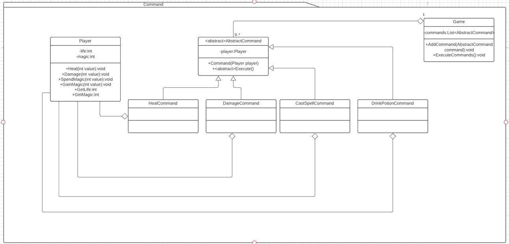

# Command
Es un patrón de comportamiento. [Link descripción](https://www.tutorialspoint.com/design_pattern/command_pattern.htm)

Este patrón se utiliza para generar una cola de comandos que ejecutan acciones sobre un receiver que incluso pueden llegar a revertirse si se implementa esa funcionalidad.

## Diagrama de clases

## SOLID

* Single responsability

Los objetos commandos ayudan a mantener clases pequeñas con una sola funcionalidad especifica.

* Open/Closed principle

Es muy facil extender la funcionalidad creando nuevos comandos que hereden del comando abstracto.

* Liskov substitution

Cualquier comando debería comportarse como el comando padre, no hay razón para incumplir este principio.

* Interface segregation

Los comandos permiten tener una interfaz muy pequeña para lograr funcionalidades muy variadas.

* Dependency inversion

Siguiendo el patrón llegamos facilmente a una dependencia en la clase abstracta, sin que el manejador de comandos (Game en este caso) dependa de implementaciones concretas, incluso se puede llegar a pasar interfaces a los comandos, que en este ejemplo reciben una instancia de Player, pero podrían perfectamente esperar una interfaz, si la hubieramos definido.

